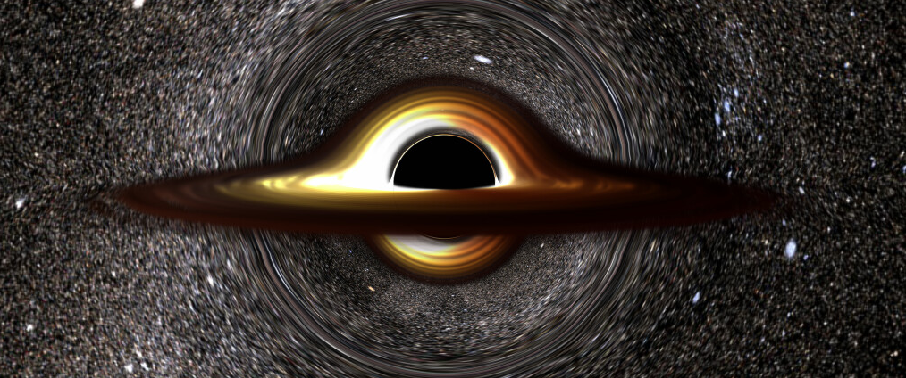

# Black Hole renderer

## Description
The Black Hole Renderer plugin is a port of the https://www.shadertoy.com/view/tsBXW3 shader toy, implemented as a plugin for [Blue Brain Brayns](https://github.com/BlueBrain/Brayns), the Blue Brain rendering platform.

## Contact

For more information on the Black Hole Renderer plugin, please contact:

__Cyrille Favreau__  
[cyrille.favreau@gmail.com](cyrille.favreau@gmail.com) 
